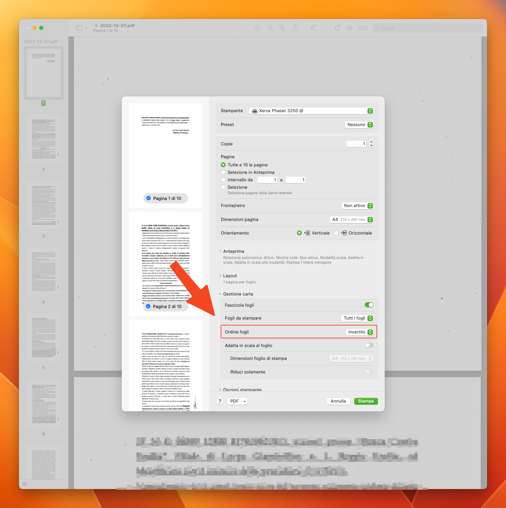
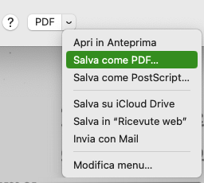
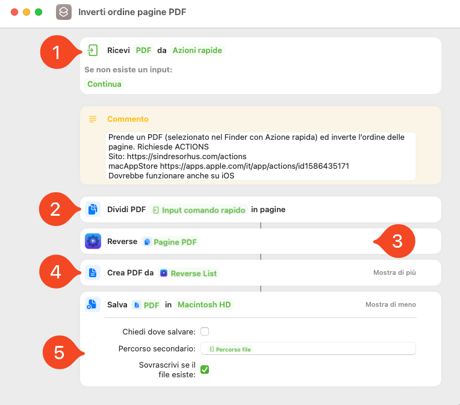
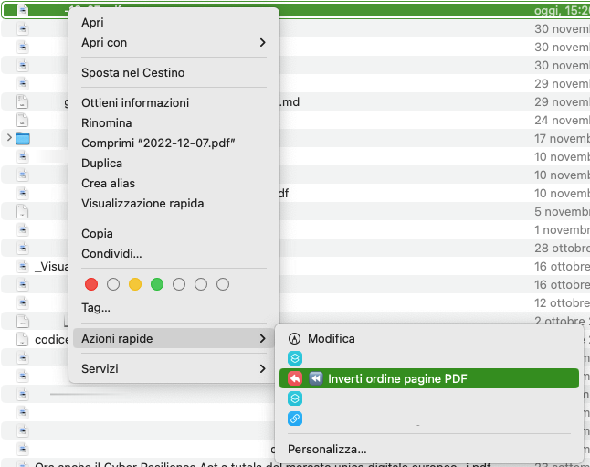

In questo articolo, che spero rimarrà breve, ti parlerò di un problema abbastanza banale che mi si è parato davanti e che ho risolto in due differenti modi. In particolare ti spiegherò come è possibile invertire le pagine di un PDF sia con gli strumenti base di macOS che con un Comando Rapido con l’aiuto di una azione presa in prestito da [Actions](https://sindresorhus.com/actions).

## Il mio problema

Come ti ho anticipato mi sono trovato con la necessità di invertire le pagine di un PDF che ho scansionato. È con rammarico che ho scoperto che il mio fido [ScanSnap iX500](https://www.fujitsu.com/global/products/computing/peripheral/scanners/scansnap/ix500/) (comprato nel lontano 2014) ha un problema ad una delle superfici di scansioni e mi lascia una visibile riga nera quando acquisisce le pagine. Essendo ormai uno scanner datato non ha senso che io cerchi di ripararlo e, me lo terrò così finché non deciderò di acquistare la sua versione più moderna.

Nel mentre, quando devo scansionare dei documenti solo fronte posso evitare la riga nera ma devo acquisirli al contrario.

Il difetto di questo escamotage è che le pagine  così acquisite vengono con l’ordine invertito.

Potrei girare manualmente all’interno di [Anteprima](https://support.apple.com/it-it/guide/preview/welcome/mac) ma, oltre ad essere tedioso, se mi trovo a dover gestire un PDF con molte pagine è un’attività prona ad errori.

Ma non ci sarà un modo per automatizzare il tutto?

Ovviamente sì!

E, visto che non ho trovato nulla in italiano, ne approfitto per scriverne velocemente io.

## Le 2 soluzioni che ho trovato

### 1. Usare le opzioni (nascoste) di Stampa di macOS

La dritta, l’ho trovata sul [forum della Community Apple](https://discussions.apple.com/thread/2560655).

Come prima cosa infatti ho cercato su internet se qualcuno aveva già risolto il problema al posto mio. In particolare ho cercato con comando da terminale o un comando rapido che facesse al caso mio.

Per quanto riguarda il comando a terminale ne ho trovati alcuni ma richiedevano l’installazione di un qualche tipo di software o script Python e non volevo aggiungere un comando che poi, se mai mi fosse servito di nuovo in futuro, avrei dovuto ricordarmi di usare e re-installare sul Mac del momento.

Non ho nemmeno trovato un comando rapido, anche se l’idea di fondo di come crearlo me la ero già prefigurata.

Facendo la ricerca, tuttavia, ho trovato una soluzione semplice già presente su macOS (ho guardato ma su iOS ed iPadOS, purtroppo, non è presente).

Tra le funzioni di stampa, infatti, ho scoperto che c'è la possibilità di invertire l’ordine di stampa delle pagine. 

Se ci aggiungi la **funzione** (sempre in Stampa) **di poter stampare un documento** (anche un PDF) **come PDF** hai risolto brillantemente il problema.

Di seguito puoi vendere (su macOS Ventura) i passaggi da seguire. Prima all’interno del pannello di stampa.

E poi con la stampa come PDF.

Ne approfitto per ricordare il trucco di David Sparks per velocizzare il passaggio di stampa come PDF: [qui](https://www.avvocati-e-mac.it/blog/2017/10/20/come-salvare-velocemente-qualsiasi-documento-in-pdf-con-il-trucco-di-david-sparks) nella mia traduzione e [qui](https://www.macsparky.com/blog/2019/09/command-p-as-canon/) nell’ultima versione aggiornata a macOS Ventura.

Unico difetto di questo sistema è che c’è bisogno di un sacco di clic. 

Te l’ho mai detto che sono una persona pigra?

Ho quindi deciso che, visto che nessuno aveva creato un comando rapido per invertire l’ordine delle pagine di un PDF, l’avrei fatto io.

### 2. Comando rapido

L’idea del comando rapido è relativamente semplice.

Prendere le singole pagine e creare un nuovo PDF con le pagine invertite.

Non ho trovato ne ho avuto voglia di creare un algoritmo per fare questa operazione.

Ho usato quindi un’azione presente nell’app [Actions](https://sindresorhus.com/actions).  È un app opensource, quindi tra le altre cose è gratuita e la puoi installare senza alcun costo (ed è anche uno dei motivi per cui l’ho scelta per questo comando rapido). 
Aggiunge un sacco di azioni a quelle già presenti in Comandi rapidi e fa parte di una serie di applicazioni il cui unico scopo è integrarsi con Comandi Rapidi. Non funziona da “sola”. È presente sia per iOS che per macOS. Mentre scrivo, richiede almeno macOS 13 o iOS 16.

**Unico limite del comando rapido**, che ti condividerò, **è che dovrai installare questa app per poterlo utilizzare.**

L’azione che mi serviva, ed ho usato nel comando rapido che ti farò vedere tra breve, è  elenco o lista inversa, _reverse list_ in inglese (l’app non ha, mentre scrivo, una traduzione in lingua italiana e così le azioni donate a Comandi Rapidi).

### Come funziona il comando rapido ?

Ho creato un comando rapido per macOS, ma con alcune modifiche dovrebbe funzionare tranqullamente anche su iOS / iPadOS. 

In particolare ho deciso (perché così sono abituato) di crearlo come [Azione Rapida del Finder](https://support.apple.com/it-it/guide/mac-help/mchl97ff9142/mac).
Quest'ultima prende un PDF selezionato nel Finder (_punto 1_), lo suddivide in singole pagine (_punto 2_), ne inverte l’ordine (_punto 3_), crea (unisce) i PDF così ottenuti in un nuovo PDF (_punto 4_), il nuovo PDF avrà le pagine invertite rispetto a quello originale, e sovrascrive quest'ultimo sul PDF originale (_punto 5_).

Di seguito puoi vedere il comando rapido come Azione Rapida all’interno del Finder.

Puoi scaricare il comando rapido da [qui](https://www.icloud.com/shortcuts/f891a5558a0146c9944794a2ade95d8d).

## In conclusione

Invertire le pagine di un PDF non è un compito che capita spessissimo ma spero di averti insegnato un utile trucco delle opzioni di Stampa di macOS e mostrato come, con poche azioni (e l‘aiuto di un’ottima applicazione) è possibile automatizzarla ulteriormente.

Se ti è piaciuto quel che hai letto, ti segnalo che puoi ricevere una email ogni volta che pubblico un nuovo articolo, basta iscriverti [qui](https://www.avvocati-e-mac.it/mailinglist), inoltre, mensilmente, scrivo una newsletter in cui parlo di quel che faccio in ambito tecnologico e condivido una serie di articoli che ho collezionato durante il mese e ho ritenuto interessanti.

