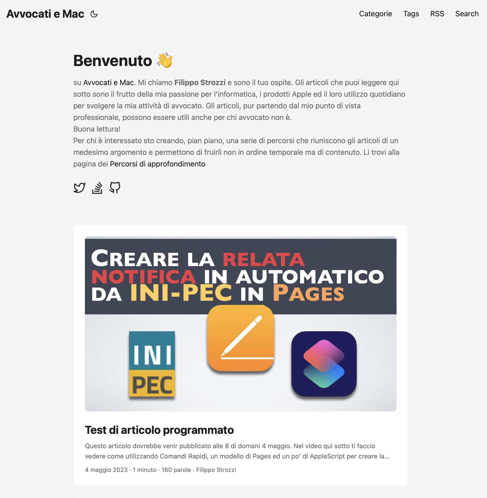

> Scrivo questo breve articolo per darti alcune comunicazioni di servizio: cancellazione delle OfficeHour di Maggio, corso in presenza a Reggio Emilia sulle notifica a mezzo PEC, il sito beta è online, la Newsletter mensile ci sarà e cercherò di far sopravvivere Compendium.
> Ma andiamo per ordine …
 
## 1. OfficeHour di Maggio

Non ci saranno le  [OfficeHour](https://www.avvocati-e-mac.it/blog/2022/11/14/aggiornamento-canale-youtube-ed-office-hour) per il mese di maggio: quella di oggi 4/5 e quella del 18/5.

Oggi sono arrivato lungo, nei 2 ponti mi sono dedicato ad altro (maggiori informazioni nei punti che seguono) e non sono riuscito a preparare quella di oggi.

Per il 18/5 non riesco perché il giorno dopo sarò, assieme al collega Giovanni Rocchi componente della FIIF,  uno dei due relatori al corso della [Camera Civile di Reggio Emilia](https://cameracivilereggioemilia.net) dal titolo: _Codex Chartabiensis alla prova dell'informatica_.

[Qui]() trovi la locandina. Il corso è in via di accreditamento e, presumo, saranno riconosciuti n.3 crediti formativi. 

Siccome sia io che Giovanni siamo due appassionati Apple credo possa essere un modo di riunire un po' di “Avvocati e Mac".

## 2. Nuovo sito in beta

Ne ho parlato nella [newsletter di Aprile](http://us12.campaign-archive.com/?u=d5cc1dd818aaf16276c0c20d6&id=27c99e2ddb) e, se non sei iscritto, ti puoi iscrivere [qui](https://www.avvocati-e-mac.it/mailinglist).

Ad Agosto il sito passerà da SquareSpace ad Hugo. 

Nei 2 ponti mi sono dedicato ad imparare (ancora non perfettamente) l'utilizzo di Hugo ed implementare le funzioni più importanti. Nei giorni scorsi sono quindi riuscito ad attivare [beta.avvocati-e-mac.it](https://beta.avvocati-e-mac.it/).

Molte cose non funzionano … ma qui potrai dare uno scorcio al futuro di _Avvocati e Mac_.

Con questo articolo inizio la pubblicazione doppia che mi permetterà spero di ottimizzare il nuovo flusso di lavoro.

### 2.1 Il nuovo sito permetterà di gestire delle collaborazioni

È ancora presto per scrivermi ma, se sei interessato a scrivere articoli su Avvocati e Mac, è il momento di iniziare a pensarci.

Giusto per sicurezza segnalo che l’unico compenso che potrai ricevere saranno la _fama e la gloria_. 😜

La mia idea di base è che il sito, per il futuro, sia scritto da una pluralità di avvocati per avvocati e non …

## 3. Newsletter

Se ti iscrivi riceverai:
- Newsletter mensile (più o meno)
	- Video che faccio per il [canale Telegram](https://t.me/+Oam6bbOkt5JiZmRk)
	- Link interessanti che raccolgo durante il mese
- Una email (il venerdì per gli articoli ed il lunedì per il podcast) _se_ e _quando_ li pubblico
	- Questa è un’automazione di Mailchimp i(che spero di far funzionare sul nuovo sito).

Ho “lisciato” la pubblicazione della newsletter mensile di febbraio e marzo ed ero abbastanza negativo sulla sua gestione a lungo termine.

Ma, sempre durante i 2 ponti, ho creato un’automazione che sto usando in questi giorni che mi ha enormemente ridotto la parte di preparazione dei link.

Sto già pensando ad ulteriore automazione per semplificarmi la vita nella creazione di altri contenuti della newsletter … quindi a Maggio posso quasi garantire che ti verrà recapitata la email.

## 4. Compendium Podcast

Volevo chiudere il podcast, l'abbandono di Squarespace infatti tra le altre cose comporterà la perdita dell’hosting di Compendium.

Come forse saprai il mio sforzo maggiore in ambito podcast è dedicato ad [A2](http://a2podcast.it), il podcast che conduco con l’amico [Roberto Marin](https://a2podcast.fireside.fm/hosts/roberto). 
La comunicazione della chiusura / cancellazione ha tuttavia portato ad una levata di scudi, per cui sto ragionando, anche se non garantisco nulla, di trovare un modo poco dispendioso di trovare una nuova casa anche per il podcast.

## In conclusione

Le comunicazioni alla fine non sono state brevissime … ma volevo darti un’idea del futuro di _Avvocati e Mac_.
